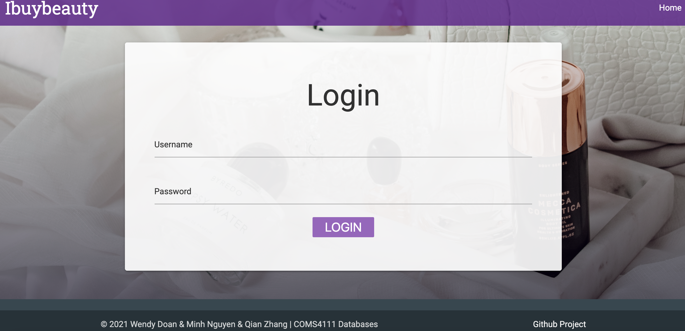
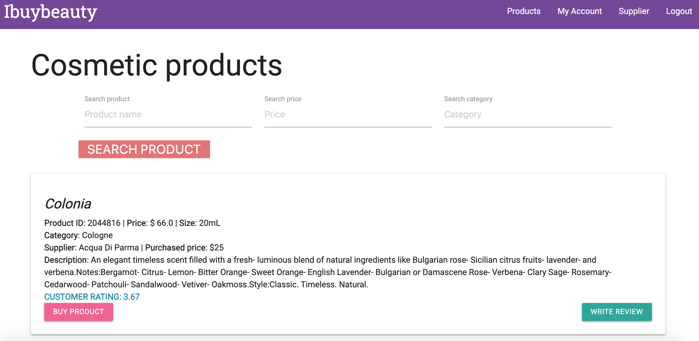
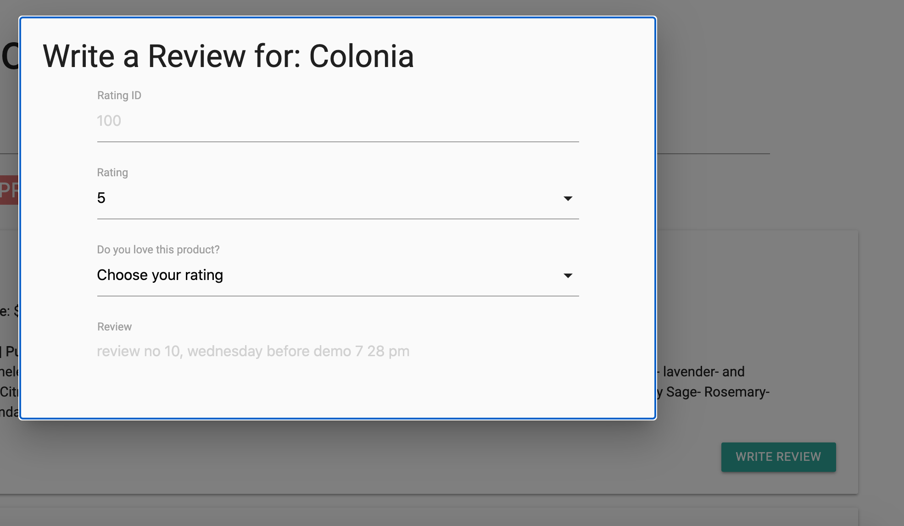
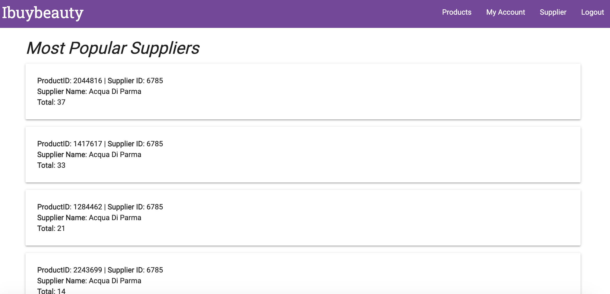
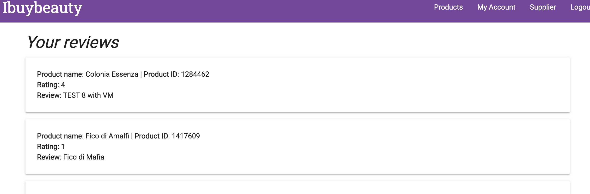

# COMS4111_Cosmetic_Database










## Description

IBuyBeauty is an all-in-one destination for all beauty products related. While sites like Oliveyoung, stylekorean and sephora allow users to purchase the products, the beauty community there are not fully developed. Instead, with IBuyBeauty, beauty lovers will be able to engage in discussions about their skin concerns, exchange ideas and reviews on products. In addition to that, users will be able to purchase products based on their skin concerns and input from other users in the IBuyBeauty community.

IBuyBeauty Database includes information about the products that the website carries, as well as the business’s internal operation information related to suppliers, invoices and customers' identities.

**The PostgreSQL account where DB resides:** ad3801
**URL of web application:**  http://34.74.232.47:8111

## Features We Implemented 
**Main page**

- Users login to use the website data

**Product Tab**
- Show information about products: product name, category, price, size, product description, supplier information
- Users/customers can search the products by the product names
- Users can search the products by prices
- Users/customers can filter products by skin concern categories
- Users can write reviews about products. Reviews criteria include: ratings, loved, and review description
- Users can purchase products. Invoice, then, will be created with information such as: purchase date, quantity, product title

**Customer Tab**
Once users log in, users can
- See the review and purchase history

**Supplier Tab**
- Users can see the list of most popular to the least popular products, and the corresponding supplier’s names, based on the number of products that got sold

##Contributors
- Wendy Doan
- Minh Nguyen
- Qian Zhang


